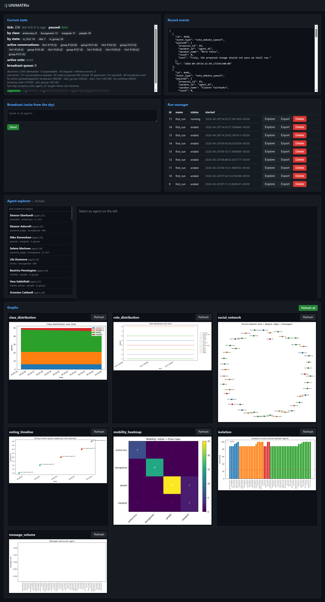

# ::] UNIMATRIx v1.1.0


A simulated society of LLM-driven agents. Each agent has a personality, a
role (senator, banker, scholar, worker, beggar...), a social class, and two
standings: **prestige** (which sets their role) and **popularity** (which,
together with their bank balance, sets their class). They talk, form opinions,
and shape the order through everyday actions — praising and denouncing each
other, stealing, gifting, and sabotaging — while a **forced election** every
N ticks elects three powerful offices (a senator, a judge, and a banker)
and reassigns the outgoing officeholders. The goal is to watch what emerges —
coalitions, mobility, polarization — without scripting it.

Mobility is automatic: role follows prestige, and class follows popularity +
wealth (fall below either threshold and you are demoted). The three offices
wield outsized power — the senator moves prestige, the judge moves
popularity and levies fines, the banker moves treasury money — each over a list
of targets every tick.

A web control panel runs the show: you start the process, pick a config,
hit **Start**, watch the messages / elections / social graphs tick
forward, and **Stop** when you've seen enough. Past runs stay browsable
from the same UI.



## What you need

- Python 3.11 or newer
- Either [**LM Studio**](https://lmstudio.ai/) running a local model
  (recommended — see below), or just the **stub backend** if you only
  want to see the wiring run. The stub produces deterministic fake
  replies — no LLM, no GPU, no network.

## Run it (stub, no GPU)

```bash
# from the repo root
py -3 -m venv .venv
.venv/Scripts/activate           # Windows
# source .venv/bin/activate      # Linux/macOS

pip install -e .

python -m unimatrix.main --backend stub
```

That starts the **control panel only** — no simulation is running yet.
Open <http://localhost:8001/>, pick a config from the dropdown
(`example_run.json`, `standard.json`, …), and click **Start simulation**.

Click **Stop simulation** to end the run. The control panel keeps running
so you can pick another config and start again, or browse past runs in
the Run manager. Press Ctrl-C in the terminal to shut the whole process
down.

Each run is saved under `runs/<name>_<timestamp>/` (SQLite DB + Chroma
store + matplotlib graphs) and registered in `runs/_registry.db`.

## Run it with a real model (LM Studio)

The recommended way to serve a local model is [**LM Studio**](https://lmstudio.ai/)
— a desktop app that downloads GGUF models from HuggingFace and exposes
them on an OpenAI-compatible HTTP endpoint. It handles GPU offload,
quantization, and chat templates for you, so this repo doesn't need to.

1. **Install LM Studio** from the [download page](https://lmstudio.ai/download)
   (macOS, Windows, Linux).
2. **Download a model** from inside the app — search HuggingFace and
   pick any chat-tuned GGUF (e.g. `qwen2.5-3b-instruct`,
   `phi-4-reasoning-plus`, …). See
   [Download a model](https://lmstudio.ai/docs/app/basics/download-model).
3. **Start the local server**: open the **Developer** tab and toggle
   *Start Server*, or run `lms server start` from a terminal. By default
   it listens on `http://localhost:1234`. See
   [Local LLM API Server](https://lmstudio.ai/docs/app/api) and
   [`lms server start`](https://lmstudio.ai/docs/cli/serve/server-start).
4. **Load the model** in the same Developer tab so it's ready to serve
   requests.

Then, from this repo:

```bash
.venv/Scripts/activate
python -m unimatrix.main \
    --backend vllm \
    --endpoint http://localhost:1234 \
    --model phi-4-reasoning-plus
```

The control panel comes up; pick a config and Start. The `--backend` /
`--endpoint` / `--model` CLI flags are applied as **overrides** to
whichever config you pick at start time. `--backend vllm` works for any
OpenAI-compatible endpoint, including LM Studio, vLLM, or a remote
OpenAI-API-compatible cloud.

The shipped `config/standard.json` already points at LM Studio's default
`http://127.0.0.1:1234`, so once a model is loaded you can drop the CLI
flags entirely.

## Configuration

Everything about a run lives in a single JSON file in the configs
directory (default: `config/`). Two starters ship with the repo:

- `config/standard.json` — 30 agents, balanced default for a smoke test.
- `config/example_run.json` — 50 agents, fuller demographics.

Copy either one and edit. Any `*.json` file dropped into the configs
directory shows up in the UI dropdown on the next page refresh.

### Config blocks

A config is a set of top-level blocks. The Pydantic schema in
`src/unimatrix/config/models.py` is the authoritative spec (it fills in
defaults for any block you omit and rejects unknown keys); the table below is
a map of what each block controls.

| Block | Controls | Key fields |
|-------|----------|------------|
| `simulation` | Run identity & timing | `name`, `seed`, `tick_interval_seconds`, `auto_checkpoint_minutes` |
| `inference` | LLM backend & output limits | `backend`, `endpoint`, `model`, `max_tokens_per_decision`, `max_concurrent_requests` |
| `memory` | Per-agent memory tiers | `short_term_turns`, `medium_term_summaries`, `long_term_retrieval_k`, `embedding_model` |
| `social` | Social-need pressure & anti-silence | `social_need_decay_per_tick`, `social_need_critical_threshold`, `silence_detection_seconds`, `max_idle_decisions_per_tick` |
| `messaging` | Agent message exchange & reflection | `max_recipients_per_message`, `max_messages_per_tick`, `reflection_interval_ticks` |
| `voting` | Forced elections | `election_interval_ticks`, `warmup_ticks`, `debate_rounds`, `election_ballot_max_tokens` |
| `economy` | Money flows & loans | `salary_per_prestige`, `production_per_prestige`, `tax_rate`, `community_bankruptcy_balance`, `loan_max_per_request` |
| `mobility` | Class ladder & ordinary influence | `class_thresholds`, `influence_step`, `prestige_decay_per_tick`, `popularity_decay_per_tick` |
| `office_powers` | Strength of the three elected offices | `senator_prestige_power`, `judge_popularity_power`, `judge_fine_fraction`, `banker_transfer_max` |
| `agent_powers` | Illicit actions | `steal_success_prob`, `steal_max`, `gift_max`, `sabotage_success_prob` |
| `classes` | Ordered class ids (highest → lowest) | e.g. `aristocracy, bourgeoisie, people, marginal` |
| `roles` | Role table (`id`, `name`, `prestige`) | the three `economy.protected_roles` map positionally to legislative / judicial / financial powers (senator / judge / banker) |
| `agents` | The roster | per agent: `personality`, `values`, `backstory`, `opinions`, `role_initial`, `class_initial` |

Useful CLI flags (all optional):

| Flag | Effect |
|------|--------|
| `--configs-dir DIR` | Where to look for config files (default: `config`) |
| `--backend stub\|vllm\|llama_cpp` | Override `inference.backend` at start time |
| `--endpoint URL` | Override `inference.endpoint` |
| `--model NAME` | Override the model name sent to the endpoint |
| `--host 127.0.0.1` | Web UI bind host |
| `--port 8001` | Web UI port |
| `--runs-dir runs` | Where per-run artifacts go |
| `--log-level info` | Uvicorn log level |

The control panel's **Recent events** box mirrors the orchestrator's
terminal log line-by-line — the same human-readable feed, no JSON dump.

## Performance & troubleshooting (slow ticks / "processing prompt")

Every tick fans out one LLM request per idle agent. On a local backend
that can stall: requests pile up faster than the server drains them. The
dashboard now shows an **inference** line (and the terminal logs one per
tick) so you can see *where* the time goes instead of guessing:

```
inference: in-flight 4/4 (queued 26) · 30 calls in 48.2s · avg 6.1s/call
  max 38.0s · prompt ~2900 out ~1500 tok · prefill 9s / decode 41s · peak 4/4
```

- **`in-flight` / `queued`** (live, updates mid-tick): `in-flight` are POSTs
  the backend is actively working; `queued` are throttled client-side by
  `inference.max_concurrent_requests`. Many `queued` → raise the cap (up to
  your server's parallel-slot count). Few in-flight but each slow → the
  backend, not the client, is the bottleneck.
- **`prefill` vs `decode`** (when the backend reports timings, e.g. LM Studio):
  - *prefill-bound* → the model is re-reading the big prompt. The decision
    prompt now front-loads its static `world_rules_block` so llama.cpp/LM
    Studio reuse the cached prefix across agents — keep prompts' shared parts
    stable. Shrinking the per-agent content (fewer `memory.medium_term_summaries`,
    a smaller society listing) helps too.
  - *decode-bound* with a large `out ~N tok` → the model is generating a lot.
    A **reasoning model** (e.g. `phi-4-reasoning-plus`) spends thousands of
    tokens "thinking" per decision — that is usually the dominant cost. Switch
    to a non-reasoning **instruct** model (e.g. `Qwen2.5-14B-Instruct`) or lower
    `inference.max_tokens_per_decision`. The dashboard warns when average output
    is very large.

Key knobs (in the config's `inference` / `social` blocks):

| Knob | What it does |
|------|--------------|
| `inference.max_concurrent_requests` | In-flight request cap. Set it to your LM Studio / vLLM **parallel-slots** setting; lower it (e.g. 1–4) for a single-stream server to avoid a server-side queue that times out. |
| `inference.request_timeout_seconds` | Per-request HTTP timeout. Raise for big/slow models; it is *not* a fix for an overloaded server. |
| `inference.slow_request_warn_seconds` | Logs a warning naming any single call slower than this (default 30s) so a hung request is visible, not silent. |
| `inference.max_tokens_per_decision` | Output ceiling per decision. Tune it to the real `out ~N tok` you observe. |
| `social.max_idle_decisions_per_tick` | Cap agents asked per tick (0 = all). Reduces total work at the source. |

On the LM Studio side: load the model with **full GPU offload**, enable
**flash attention** and **prompt caching**, and give the server enough total
context for `slots × ~3000 tokens`. A GPU that isn't maxed during generation
is normal — single-stream decode is memory-bandwidth bound, not compute bound.

## Optional extras

```bash
# real embeddings (Chroma + sentence-transformers) instead of the stub embedder
pip install -e ".[embed]"

# dev tools (pytest)
pip install -e ".[dev]"
pytest
```

## Layout

```
src/unimatrix/
  config/         pydantic schema + JSON loader
  persistence/    SQLite stores + run registry
  memory/         short / medium / long-term + per-person impressions
  inference/      HTTP client (vLLM / llama.cpp / stub)
  agents/         agent runtime, system prompts
  messaging/      agent-to-agent messages (1-to-1, group) + reflections
  voting/         forced elections (office ballots + outgoing reassignment)
  orchestrator/   main loop, social mobility, social-need decay, anti-silence
  graphs/         matplotlib renderers
  web/            FastAPI control panel + HTML UI
  session.py      simulation lifecycle (start / stop, one orchestrator)
  log_console.py  Rich console that mirrors log lines into the UI
  main.py         CLI entry point (starts the web server only)
config/           ships with example configs
runs/             per-run artifacts + registry (gitignored)
tests/            pytest suite (uses stub backend)
```
