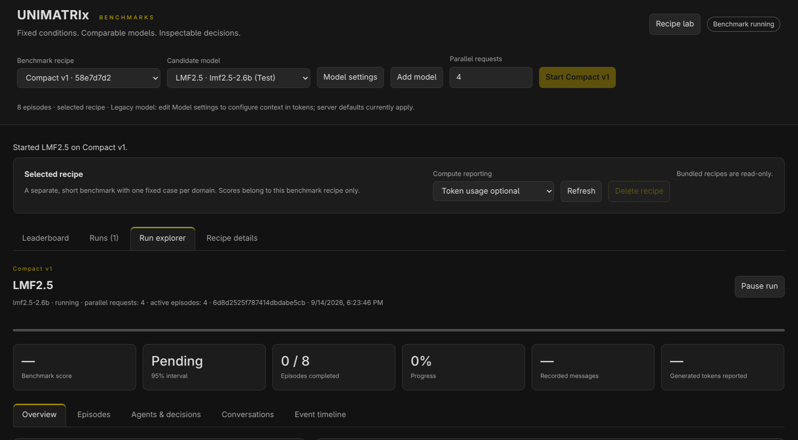

# UNIMATRIx v3.0.0

A local model benchmarking system with fixed, versioned benchmark recipes and an
interactive run explorer.



```bash
uv sync --extra dev
uv run unimatrix serve
```

Open [the dashboard](http://127.0.0.1:8001/). Add or import a **candidate model JSON**,
select a **Benchmark recipe**, then click **Start [recipe name]**. The benchmark
runs automatically using the selected recipe.

- **Leaderboard:** completed competitors under the same recipe revision, engine
  fingerprint and compute reporting track. The latest complete run of each exact
  candidate configuration is ranked; incomplete runs never receive a score.
- **Runs:** every attempt, progress, failures, pause and resume.
- **Run explorer:** domain scores, score breakdowns, individual episodes, resource
  charts, agent snapshots, saved observations and responses, conversations and events.
- **Recipe details:** the actual read-only JSON defining the benchmark conditions.
- **Recipe lab:** a separate [research page](http://127.0.0.1:8001/recipe-lab) for building
  recipe drafts, running calibration and intervention evaluations, and inspecting findings.
  **Open explorer** shows live study and episode progress, agent decisions, model calls,
  conversations and events. **Guide** and section **Info** buttons explain options and metrics.

## Authored recipes

The bundled [Standard v1](src/unimatrix/benchmark/plans/standard-v1.json) contains
64 explicit cases: eight domains, four seeds and two roles.
[Compact v1](src/unimatrix/benchmark/plans/compact-v1.json) contains eight cases and
has its own leaderboard. Both default to seven scripted peers. In the Lab, choose 7–127 peers and assign
each a scripted policy or a model with its own personality system prompt.
All new recipes use one fixed set of scenario rules (the former level 2).
These initial recipes are experimental, not empirically certified benchmarks.

Create subsequent recipes in **Recipe lab**, or write JSON files in `config/recipes/`. Give each one a
new `id` and `name`. The cases are an explicit list, not generated by a script at
startup. To select a new standard version:

```bash
uv run unimatrix serve --default-recipe my-recipe-v2
```

The recipe selector controls both the displayed results and the next benchmark.
The Start button shows the selected recipe name. `--default-recipe` sets the initial
selection; archived revisions are available for inspection only.
A recipe's content and the engine fingerprint determine its leaderboard revision.
Changing a recipe cannot mix new scores into the previous ranking. Historical runs
retain their complete original recipe and remain visible even if its source file is
changed or removed. Resume requires the original engine fingerprint.

## Candidate models

The model dialog reads and writes `config/models/*.json`. It exposes address,
port, model name, snapshot, optional API key and advanced inference settings.
The client calls `ADDRESS/v1/chat/completions`. API keys entered in the dialog are
stored in separate private files and are not copied into the run records or reports.
Changing credentials creates a new private file so historical runs keep their source.
Environment variable credentials (`api_key_env`) are also supported.

Use `--models-dir`, `--recipes-dir` and `--runs-dir` to select other directories.
This is a local researcher interface; the server binds to loopback by default.

```bash
uv run unimatrix recipes
uv run unimatrix run --model config/models/my-model.json
uv run unimatrix run --model config/models/my-model.json --recipe compact-v1
uv run unimatrix replay --run runs/benchmarks/RUN_ID/episodes/EPISODE_ID --verify-hashes
```

A benchmark directory contains `benchmark.json`, per-episode SQLite evidence and,
after full completion, `report.json`. The dashboard can export the completed report.
No provider requests are made merely by selecting a recipe or inspecting saved data.

[Recipe lab guide](docs/recipe-lab.md) · [Model and recipe format](docs/benchmark.md) · [Validation](docs/validation.md)

```bash
uv run pytest
uv run ruff check src tests --exclude tests/fixtures
```

[MIT License](LICENSE).
